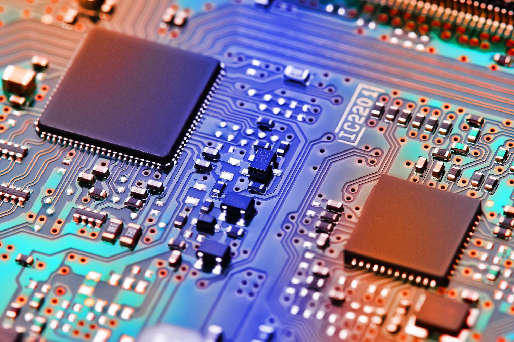
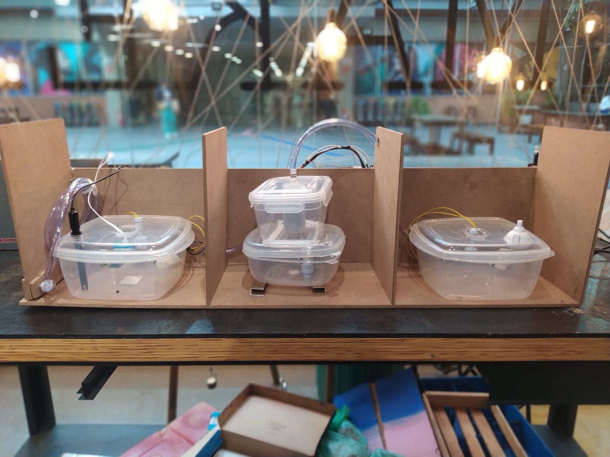

# FECAP - Fundação de Comércio Álvares Penteado

# AquaCicle

## Alvacoders

## Integrantes: <a href="https://www.linkedin.com/in/matheus-moura-77b7a213a/">Matheus Moura</a>, <a href="https://www.linkedin.com/in/murilo-dias-da-silva-9265292a1?utm_source=share&utm_campaign=share_via&utm_content=profile&utm_medium=android_app">Murilo Dias</a>, 

## Professores Orientadores: <a href="https://www.linkedin.com/in/victorbarq/"> Victor Bruno </a>, <a href="https://www.linkedin.com/in/victorbarq/">Adriano Felix Valente</a>, <a href="https://www.linkedin.com/in/victorbarq/"> Jose Carlos </a> 

## Descrição

  Projeto by <a rel="cc:attributionURL dct:creator" property="cc:attributionName" href="https://github.com/2023-2-NADS1/Grupo6/tree/main">Matheus Moura da Silva e Murilo Dias da Silva</a> is licensed under <a href="http://creativecommons.org/licenses/by/4.0/?ref=chooser-v1" target="_blank" rel="license noopener noreferrer" style="display:inline-block;">Attribution 4.0 International</a>

O objetivo do nosso grupo é desenvolver um projeto que tenha um impacto direto nas <a href="https://brasil.un.org/pt-br/sdgs">Objetivos de desenvolvimento Sustentável da Organização das Nações Unidas(ONU)<a/>, com a ajuda da Internet das coisas.
Com isso desenvolvemos um projeto em que visa realizar o tratamento da água de reuso das chuvas para uso da população.
  
Já que nosso projeto deveria fazer sentido com os Objetivos de Desenvolvimento Sustentavél da ONU, a primeira coisa após termos decidido qual seria o o projeto, fomos então indentificar em qual Objetivos de desenvolvimento Sustentável o nosso projeto se enquadrava sendo dois objetivos, conforme abaixo:
  
Atender ao objetivo 6.3 da ODS 6- Agua potável e saneamento: Reduzindo à metade a proporção de águas residuais não tratadas e aumentando substancialmente a reciclagem e reutilização segura globalmente (ONU)
  
Atender ao objetivo 12.2 da ODS 12- consumo e produção resposável)  Até 2030, alcançar a gestão sustentável e o uso eficiente dos recursos naturais (ONU).
  
Com todos os nossos objetivos definidos, podemos partir para a montagem do nosso projeto, onde vamos captar a água da chuva e realizar o tratamento dessa água e disponibilizar para a população para a lavagem de carros ou qualquer outro serviços que o individuo precisar utilizar, ou seja o nosso projjeto conssite em três fases, conforme abaixo:
  
1° Captação da água para um reservatório.
  
2° Estação de tratamento da água.
  
3° Disponibilização da água tratada

  

## 🛠 Instalação

  
Nesta etapa vamos demosntrar como fazer a programação no do código para o arduino e esp32 para que esta localizado na pasta src.

1° Baixar a IDLE do Arduino para fazer o código e realizar o upload para o arduino e esp32.
  
2° Indentificar qual o tipo de arduino e esp32 que você esta utilizando e baixe as bibliotecas caso necessário, nós utilizamos o Arduino UNO e o Esp32.
  
3° Separamos os componentes do nosso projeto entre o arduino e esp321 para não termos divergencias nos dados coletados pelo esp32.
  
4° Desenvolvemos o codigo para o arduino para o gerenciamento das bombas.
  
5° Desenvolvemos o codigo para o eps32 para o gerenciamento das bombas.
  

Abaixo na configurção para desenvolvimento está os componentes que utilizamos para a montagem do nosso projeto.

  
## 💻 Configuração para Desenvolvimento
  

  

No nosso projeto utilizamos os seguintes elementos de comunicação para conseguirmos realizar as leituras de dados e fazer com que o projeto cumpra com o objetico que nos o desenvolvemos.
  
Os 4 sensores controlados e 1 filtro de agua controlados por IOT estão listados abaixo:
  
Sensor de Turbidez: Com este sensor podemos verificar a Turbidez da agua captada ou seja a transparencia da agua.
  
Sensor de Ph: Com este sensor podemos verificar o indice de Ph da água.
  
Sensor de Nivel: Uma boia para podermos verificar o nivel de água de cada estação.
  
Bomba de Agua: Utilizado para fazer com que a agua seja trasportada entre as estações.
  
Filtro de Agua: Para que o tratamento seja realizado.
  
Com o todos os os sensores devidamente ligados utilizamos o Arduino e Esp32 para podermos gerenciar os dados e controlar cada sensor para que o projeto realize o seu objetivo com sucesso. 
  

## 🗃 Histórico de lançamentos
  

A cada atualização os detalhes devem ser lançados aqui.

* 0.2.2 - 21/11/2023
    * Montamos a versão atual do projeto.
    * MUDANÇA: Fizmos a alteração do sensores de ph e turbidez para o esp32, para não termos interferencia nos dados coletados.
* 0.2.1 - 17/11/2023
    * MUDANÇA: Montamos uma base de mfd para colocarmos o projeto e alocarmos os cabos, fonte, arduino e esp32.
* 0.2.0 - 10/11/2022
    * MUDANÇA: Compramos um filtro de carvão para a estção de tratmento e o mdf para fazermos a base do projeto.
    * ADD:Colocamos um eps32 para fazemos que ele recebece-se o dados do arduino e nos mostra-se o valor do  ph e turbidez.
* 0.1.1 - 01/11/2023
    * CONSERTADO: Compramos reles, para que as bombas liguem e desliguem quando necessário conforme programamos no arduino.
* 0.1.0 - 27/10/2023
    * Realizamos o primeiro prototipo com todos os sensores e bombas
    * MUDANÇA: Precisamos encontrar uma forma de como parar as bombas que estão ativadas o tempo todo.
* 0.0.1 - 19/10/2023
    * Indentificamso os sensores e como iriamos montar o projeto.
  
## 📋 Licença/License

<a property="dct:title" rel="cc:attributionURL" href="https://github.com/2023-2-NADS1/Grupo6/tree/main">AquaCicle</a> by <a rel="cc:attributionURL dct:creator" property="cc:attributionName" href="https://github.com/2023-2-NADS1/Grupo6/tree/main">Matheus Moura da Silva e Murilo Dias da Silva</a> is licensed under <a href="http://creativecommons.org/licenses/by/4.0/?ref=chooser-v1" target="_blank" rel="license noopener noreferrer" style="display:inline-block;">Attribution 4.0 International</a>
 

## 🎓 Referências

Aqui estão as referências usadas no projeto.

1. [<https://github.com/iuricode/readme-template>](https://www.youtube.com/watch?v=1gSO4jCAuIk)
2. [<https://github.com/gabrieldejesus/readme-model>](https://repositorio.uniceub.br/jspui/bitstream/235/5934/1/21063094.pdf)
